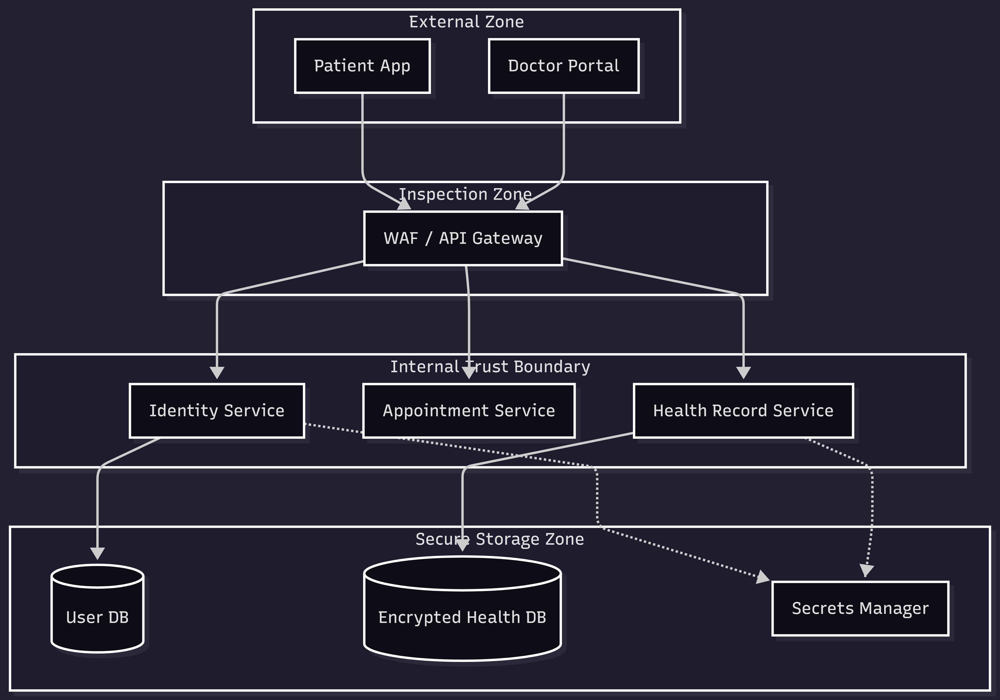
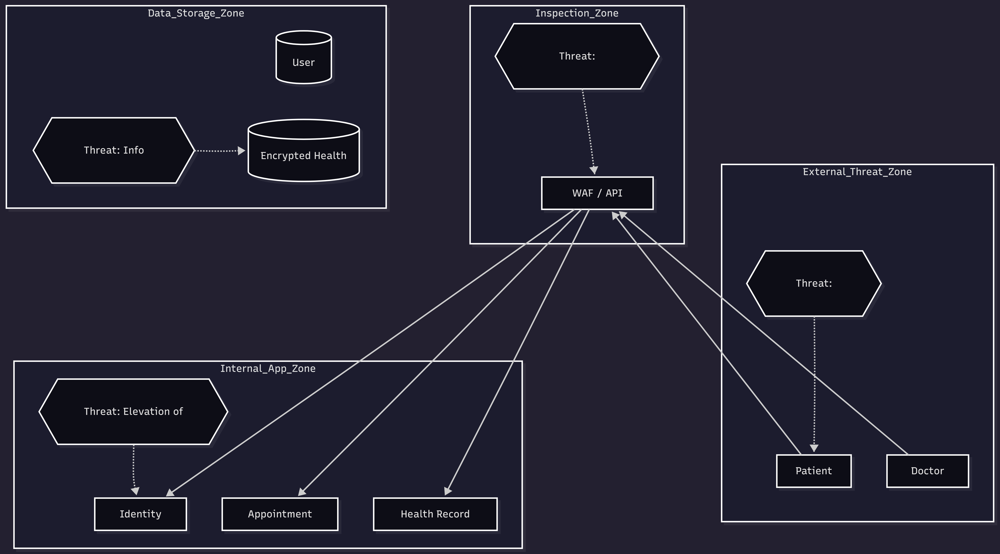

# Hospital Secure Threat Model
# Secure Architecture & Design: Healthcare Appointment System
**Student:** Taha Hunaid Ali 
**Course:** Secure Architecture and Design  
**Due Date:** February 28, 2026  

## Executive Summary
This project presents a secure-by-design architecture for a Healthcare Appointment System. Given the sensitivity of Protected Health Information (PHI), the design focuses on strong identity management, network segmentation, and data encryption to meet HIPAA-level security standards.

## Task 1: System Definition & Architecture

### 1.1 Application Components
- **Patient Portal:** Web/Mobile frontend for booking and viewing records.
- **Doctor Portal:** Management interface for schedules and consultation notes.
- **API Gateway:** Central entry point for routing, rate limiting, and initial authentication.
- **Microservices:** Identity Service (Auth), Appointment Service, and Patient Record Service.
- **Data Stores:** User Database (Credentials) and Health Record DB (Encrypted Clinical Data).

### 1.2 Users, Data Types, and Dependencies
* **Users and Roles:**
    * **Patient:** Accesses own PHI and manages appointments.
    * **Doctor:** Manages clinical schedules and views patient histories.
    * **System Admin:** Manages infrastructure and system configurations.
* **Data Types Handled:**
    * **PHI:** Clinical records, medications, and diagnosis data.
    * **PII:** Names, SSNs, and contact information.
    * **Financial Data:** Billing records and insurance information.
* **External Dependencies:**
    * **Insurance Verification APIs:** Validating patient coverage.
    * **Notification Services:** SMS and Email gateways for appointment reminders.

### 1.3 High-Level Architecture Diagram

---

## Task 2: Asset Identification and Security Objectives

The following assets have been identified as critical to the system. Security objectives are prioritized based on the sensitivity of Health Information.

| Asset | Type | Confidentiality | Integrity | Availability | Accountability |
| :--- | :--- | :--- | :--- | :--- | :--- |
| **Patient PHI** | Data | **High** | **High** | **Medium** | **High** |
| **Admin Credentials** | Credentials | **High** | **High** | **Low** | **High** |
| **Doctor Schedules** | Logic | **Low** | **High** | **High** | **Medium** |
| **Audit Logs** | Security | **Medium** | **High** | **Medium** | **High** |
| **API Keys** | Secrets | **High** | **Medium** | **High** | **High** |

---

## Task 3: Threat Modeling (STRIDE)

Using the **STRIDE** methodology, we analyzed the primary components of the Healthcare system to identify high-risk architectural threats.

| Threat Category | Affected Component | Description | Impact | Risk Level |
| :--- | :--- | :--- | :--- | :--- |
| **Spoofing** | Identity Service | Attacker impersonates a physician via stolen credentials. | Unauthorized access to sensitive PHI. | **High** |
| **Tampering** | API Gateway | MITM attack modifies appointment dates or patient vitals in transit. | Incorrect medical records; danger to patient safety. | **High** |
| **Information Disclosure** | Data Storage | Exposure of unencrypted database backups or logging of PHI. | Massive HIPAA violation and legal liability. | **High** |
| **Denial of Service** | Web Portals | Exhausting server resources via botnet to prevent patient access. | Patients cannot book or view emergency care info. | **Medium** |
| **Elevation of Privilege** | Appointment Service | A patient user modifies their JWT to gain administrative access. | System-wide compromise of the user database. | **High** |
| **Repudiation** | Logging Service | Malicious administrator deletes logs to cover traces. | Lack of forensic evidence/accountability. | **High** |

### 3.1 Risk Reasoning

Threats involving Information Disclosure and Tampering of medical data are assigned a High risk level due to the legal and safety implications inherent in healthcare systems.

### 3.2 Programmatic Risk Calculation

The logic (implemented in scripts/risk_calc.py) is used to categorize risk levels objectively.

### Threat diagram

---

## Task 4: Secure Architecture Design

Rather than applying code-level patches, the following architectural controls have been implemented to create a **Defense-in-Depth** strategy.

### 4.1 Identity and Access Management (IAM)
* **Control:** Implementation of **OIDC/OAuth 2.0** with mandatory **Multi-Factor Authentication (MFA)**.
* **Justification:** Mitigates **Spoofing** by ensuring that even if a password is leaked, the account remains protected.

### 4.2 Network Segmentation
* **Control:** Deployment of a **Three-Tier Architecture** (DMZ, App Tier, Data Tier).
* **Justification:** Prevents direct internet access to the **Health Record DB**, enforcing a hard trust boundary between the public internet and sensitive assets.

### 4.3 Data Protection & Secrets Management
* **Control:** Enforcement of **TLS 1.3** and **Field-Level Encryption (AES-256)** via a dedicated **Secrets Vault**.
* **implementation:** (security-config/vault-policy.hcl)
* **Justification:** Mitigates **Information Disclosure**; even if the storage layer is compromised, the data remains unreadable without keys stored in the Vault.

### 4.4 Logging and Monitoring
* **Control:** Immutable audit trails for all administrative actions and PHI access.
* **Justification:** Ensures **Accountability** and allows for forensic analysis in the event of a breach.
  
### 4.5 Secure Deployment Practices
* **Control:** Use of Infrastructure-as-Code (IaC) with automated vulnerability scanning in the CI/CD pipeline.
* **Justification:** Ensures a consistent, cloud-agnostic secure baseline for every deployment.
---

## Task 5: Risk Treatment and Residual Risk

| Threat | Treatment | Reasoning |
| :--- | :--- | :--- |
| **PHI Leak** | **Mitigate** | Reduced to acceptable levels via encryption and VPC isolation. |
| **DDoS Attacks** | **Transfer** | Handled by cloud-native WAF and CDN providers. |
| **System Downtime** | **Mitigate** | Multi-AZ deployment ensures high availability. |
| **Insider Threat** | **Accept** | Residual risk exists; handled via "Principle of Least Privilege" and anomaly detection. |

### Residual Risk Explanation
While the architecture reduces the attack surface, risk remains regarding Zero-Day vulnerabilities and Social Engineering. These are accepted but monitored through continuous behavioral analysis and regular staff security training.

## Task 6: Final Assumptions and Limitations

* The architecture is cloud-agnostic; no vendor-specific services are required.
* Must assume internet-facing exposure for all public portals.
* Physical data center security is assumed to be managed by the underlying infrastructure provider.

